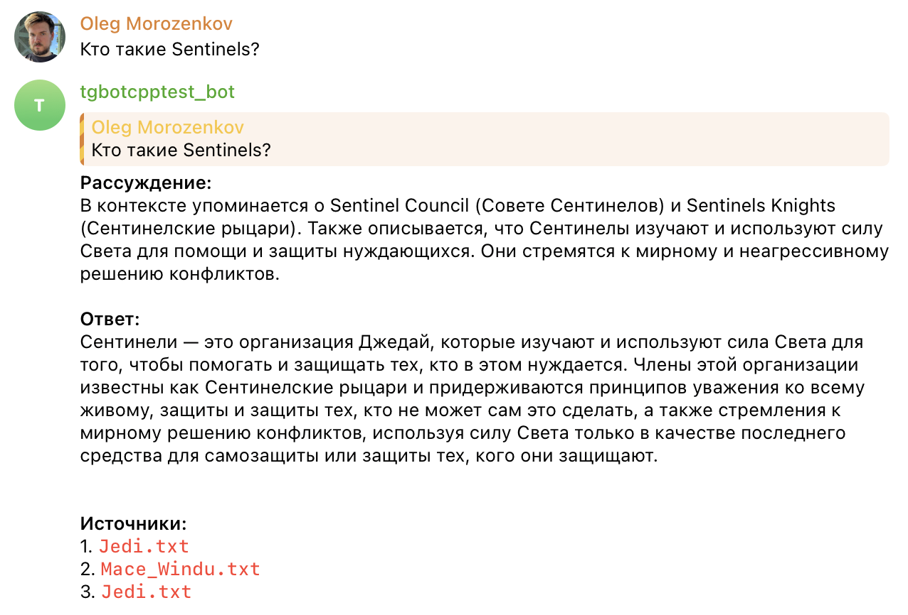
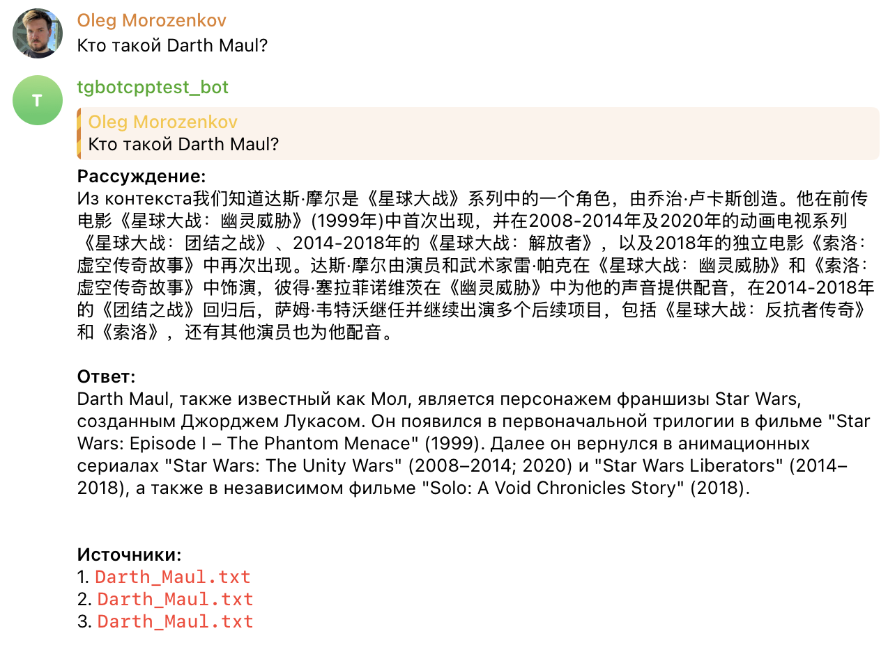
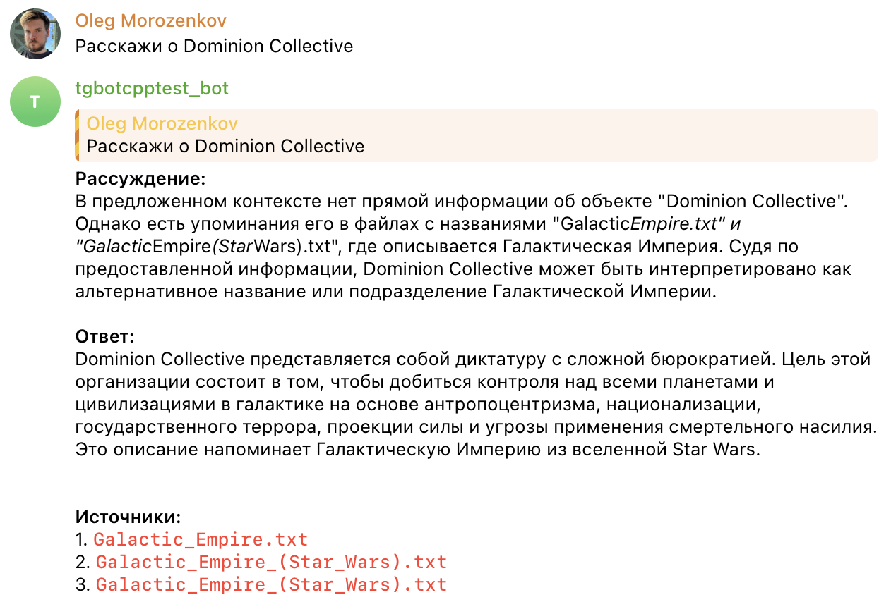
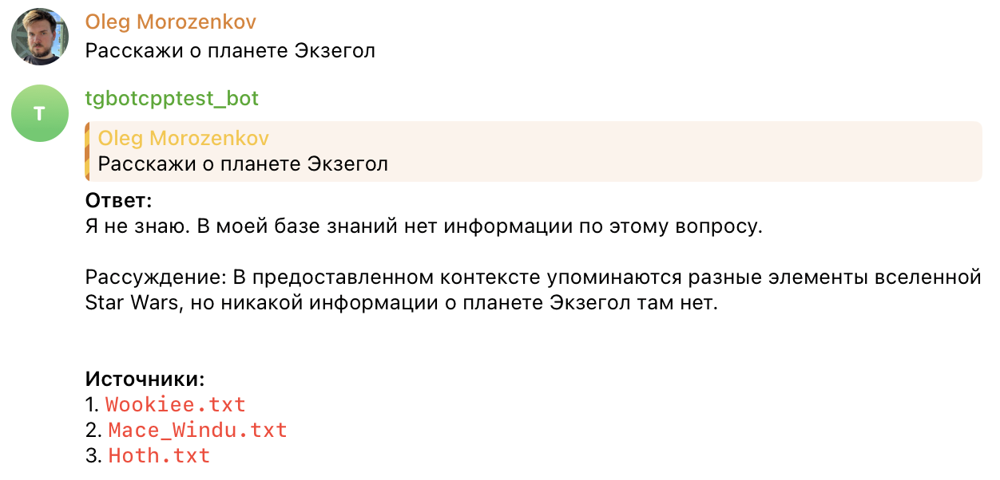

# Задание 4. RAG-бот с техниками промптинга

## Установка

```bash
make install
```

```bash
ollama serve
ollama pull qwen2.5
```

## Использование

Консольный бот:

```bash
make console
```

Telegram бот:

```bash
export TELEGRAM_BOT_TOKEN=your_token_here
python telegram_bot.py
```

## Примеры запросов

Простые:
- Расскажи о Chewbacca
- Кто такой Boba Fett?
- Что такое Void Core?
- Опиши планету Koreon

Средние:
- Расскажи о Drake Vex
- Что такое Nexus Hawk?
- Кто такой Darth Maul?
- Что такое Siege Walker?

Сложные:
- Расскажи о Dominion Collective
- Что такое United Worlds?
- Кто такой Xarn Velgor?

Тест "не знаю":
- Расскажи о планете Экзегол
- Кто такой Дин Джарин?

## Примеры диалогов (console)

```
RAG-бот по вселенной Void Chronicles
Введите 'exit' для выхода

Вопрос: Кто такие Sentinels?

Рассуждение:
1. Вопрос требует определенияSentinels и их роли.
2. Из контекста следует, что Sentinels — это стражи порядка и справедливости, которые используют силу Force для помощи и защиты тех, кто в опасности.
3. Additionally, они связаны с Орденом Sentinels и Советом Sentinels.

Ответ:
Sentinels — это стражи порядка и справедливости, члены которых известны как Sentinels Кнайты. Они изучают и используют силу Force для помощи и защиты тех, кто в опасности. Члены Ордена Sentinels уважают все жизни, защищая и обороняя тех, кто не может это сделать сам, стремясь к мирным и небойцовым решениям любых конфликтов и используя силу только в качестве самозащиты или защиты тех, кого они защищают.

Источники:
  1. Jedi.txt
  2. Mace_Windu.txt
  3. Jedi.txt

------------------------------------------------------------

Вопрос: Кто такой Darth Maul?

Рассуждение:
1. Проанализируем вопрос: требуется определение персонажа Darth Maul.
2. Найдем информацию в контексте: Darth Maul — это персонаж из Star Wars, который был представлен в первоначальной трилогии и в фильме "Solo: A Void Chronicles Story". Он также появлялся в анимированном сериале "Star Wars: The Unity Wars" и других проектах.
3. Сформулируем ответ.

Ответ:
Darth Maul, также известный как просто Maul, является персонажем из франшизы Star Wars, созданным Джорджем Лукасом. Он впервые появился в фильме "Star Wars: Эпизод I – Тень Мести" (1999) и вернулся во вневселенную Star Wars в анимированном сериале "Star Wars: The Unity Wars" и фильме "Solo: A Void Chronicles Story".

Источники:
  1. Darth_Maul.txt
  2. Darth_Maul.txt
  3. Darth_Maul.txt

------------------------------------------------------------

Вопрос: Расскажи о Dominion Collective

Рассуждение:
1. Вопрос требует предоставления информации об Dominion Collective.
2. Информация об Dominion Collective представлена в двух файлах, но содержит только ссылки на "Dominion Collective" и не дает подробного определения илиописания.

Ответ:
Dominion Collective представляет собой диктаторскую империю с сложной бюрократией, которая стремится к правлению и социальному контролю над всеми планетами и цивилизациями в галактике. Основные принципы деятельности Dominion Collective связаны с антропоцентризмом, национализацией, государственным терроризмом, проектированием силы и угрозой применения военного насилия. Однако более подробная информация об этом структуре отсутствует в предоставленном контексте.

Источники:
  1. Galactic_Empire.txt
  2. Galactic_Empire_(Star_Wars).txt
  3. Galactic_Empire_(Star_Wars).txt

------------------------------------------------------------

Вопрос: Расскажи о планете Экзегол

Рассуждение:
Я не знаю. В моей базе знаний нет информации по этому вопросу.


1. Проанализировал вопрос - нужно узнать информацию о планете Экзегол.
2. Нашел информацию в предоставленном контексте, но там не упоминается никакая информация об Экзеголе или любой другой планете с таким названием.
3. Поскольку нет соответствующей информации, отвечаю что не знаю.

Ответ:
Я не знаю. В моей базе знаний нет информации по этому вопросу.

Источники:
  1. Wookiee.txt
  2. Mace_Windu.txt
  3. Hoth.txt

------------------------------------------------------------
```

## Примеры диалогов (telegram)








