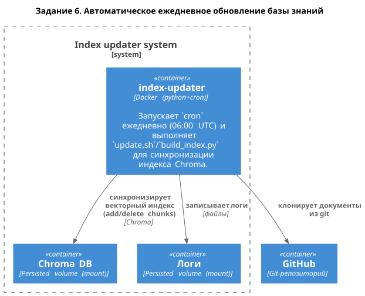

# Задание 6. Автоматическое ежедневное обновление базы знаний

Ежедневно по `cron` пересобирается/синхронизируется индекс Chroma из документов `Task2/knowledge_base` (временный `git clone` ветки `rag`).

## Запуск

```bash
make up
```

Разово:

```bash
make run-onehot
```

## Cron

Расписание из `Task6/docker-compose.yml`: `CRON_SCHEDULE="0 6 * * *"` (06:00 UTC).

## Логи

- `Task6/logs/index_update.log` — JSON-lines (в конце: `errors: []` при успехе)
- `Task6/logs/cron.log` — stdout/stderr cron

Пример:
```
{"started_at": "2026-03-18T22:26:41.802543Z", "knowledge_base_dir": "/app/download/Task2/knowledge_base", "chroma_db_dir": "/data/chroma_db", "documents_count": 42, "chunks_count": 1383, "elapsed_sec": 8.74, "errors": [], "added_chunks_count": 1383, "deleted_chunks_count": 0, "final_chunks_count": 0, "finished_at": "2026-03-18T22:26:54.484653Z"}
{"started_at": "2026-03-18T22:28:22.826310Z", "knowledge_base_dir": "/app/download/Task2/knowledge_base", "chroma_db_dir": "/data/chroma_db", "documents_count": 42, "chunks_count": 1383, "elapsed_sec": 9.3, "errors": [], "added_chunks_count": 0, "deleted_chunks_count": 1383, "final_chunks_count": 1383, "finished_at": "2026-03-18T22:28:36.322731Z"}
{"started_at": "2026-03-18T22:29:42.286238Z", "knowledge_base_dir": "/app/download/Task2/knowledge_base", "chroma_db_dir": "/data/chroma_db", "documents_count": 42, "chunks_count": 1383, "elapsed_sec": 9.02, "errors": [], "added_chunks_count": 0, "deleted_chunks_count": 0, "final_chunks_count": 1383, "finished_at": "2026-03-18T22:29:56.692164Z"}
{"started_at": "2026-03-18T22:46:53.931831Z", "knowledge_base_dir": "/app/download/Task2/knowledge_base", "chroma_db_dir": "/data/chroma_db", "documents_count": 42, "chunks_count": 1383, "elapsed_sec": 9.25, "errors": [], "added_chunks_count": 1351, "deleted_chunks_count": 1351, "final_chunks_count": 1383, "finished_at": "2026-03-18T22:47:07.250809Z"}
{"started_at": "2026-03-18T22:47:20.586638Z", "knowledge_base_dir": "/app/download/Task2/knowledge_base", "chroma_db_dir": "/data/chroma_db", "documents_count": 42, "chunks_count": 1383, "elapsed_sec": 9.14, "errors": [], "added_chunks_count": 0, "deleted_chunks_count": 0, "final_chunks_count": 1383, "finished_at": "2026-03-18T22:47:33.107225Z"}
```

## Диаграмма


