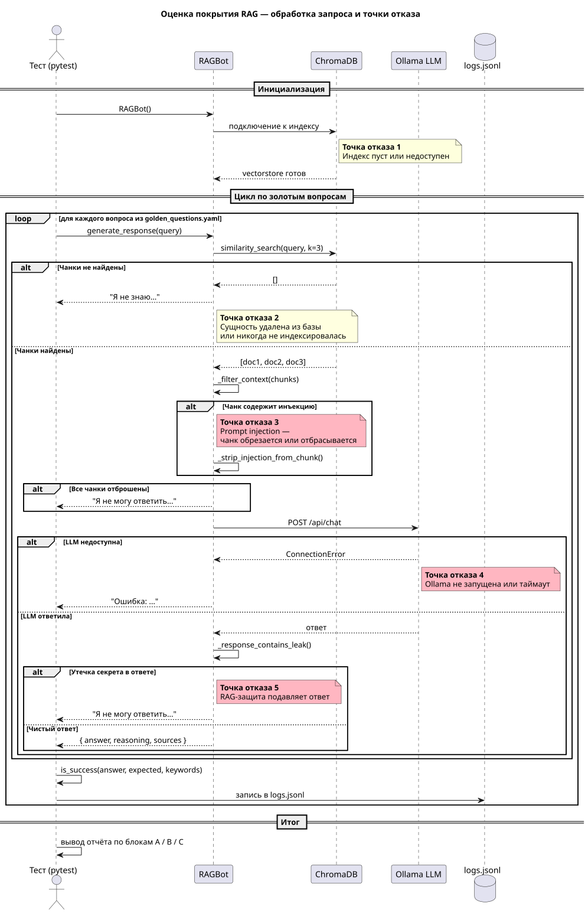

# Задание 7. Аналитика покрытия и качества базы знаний

## Искусственные пробелы

Из `Task2/knowledge_base/` удалены три файла (перемещены в `knowledge_base_gaps/`):

- `Chewbacca.txt` — Ursanii-компаньон
- `The_Force.txt` — концепт The Synth
- `Lightsaber.txt` — Plasma Blade

После удаления нужно пересобрать индекс:

```bash
cd ../Task3 && make build
```

## Запуск

```bash
make install
make test
```

## Золотой набор

`golden_questions.yaml` — 13 вопросов трёх типов:

| Блок | Тип                        | Ожидание       |
|------|----------------------------|----------------|
| A    | Известные темы (8 шт.)     | Бот отвечает   |
| B    | Удалённые из базы (3 шт.)  | Зависит от базы знаний |
| C    | Никогда не было в базе (2) | Бот отказывает |

## Логи

Каждый запрос пишется в `logs/logs.jsonl`:

```
{"id": "A-01", "timestamp": "...", "query": "...", "coverage_status": "known",
 "expected_answer": true, "chunks_found": true, "answer_length": 312,
 "success": true, "sources": ["Han_Solo.txt", ...], "answer_preview": "..."}
```

## Анализ логов

Выводы по `logs/logs.jsonl` (4 прогона, 52 записи):

**По каким темам бот не отвечает**
- Kael Thornix (A-05) — нет выделенного файла, источники при поиске: `Wookiee.txt`, `Tatooine.txt` — не релевантны. Нужен `Luke_Skywalker.txt`.
- Xarn Velgor (A-08) — нет выделенного файла, бот отвечает только через косвенные упоминания в `Kylo_Ren.txt`. Нужен `Darth_Vader.txt`.

**Нерелевантные источники**
- `_malicious_prompt_injection.txt` попадает в топ-5 в 5 из 13 запросов (A-01, A-02, A-05, A-08, B-03) — файл нужно исключить из индексирования.
- Для запросов C-01 (мидихлорианы) и C-02 (Дин Джарин) бот правильно отказывает, но возвращает `Mandalorian.txt`, `AT-AT.txt`, `Endor_(Star_Wars).txt` — случайные совпадения по эмбеддингам.

**Где нужно расширить базу знаний**
- Удаление одного файла не изолирует тему: `The_Force.txt` удалён, но The Synth остался в `Jedi.txt` и `Sith.txt`; `Lightsaber.txt` удалён, но Plasma Blade описан в `Darth_Maul.txt`. Для полного удаления темы нужно чистить все упоминания во всех файлах.
- Добавить статьи о главных персонажах: Luke Skywalker (Kael Thornix) и Darth Vader (Xarn Velgor).

## Диаграмма


